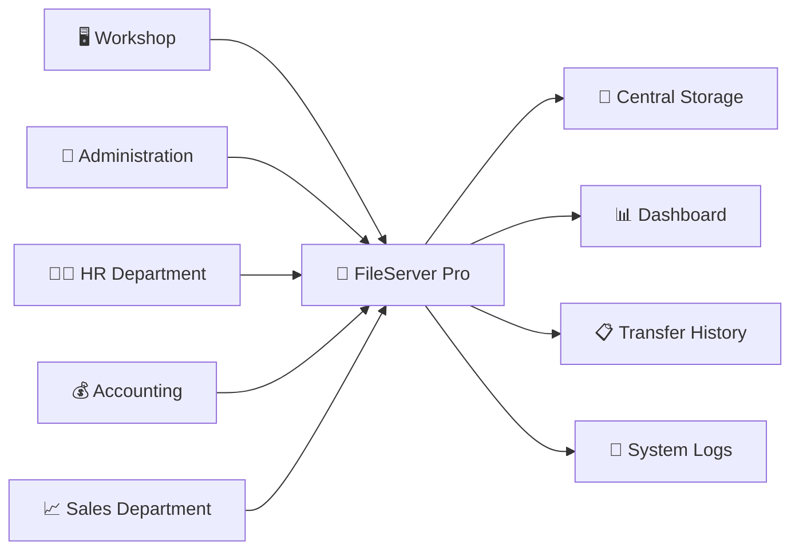
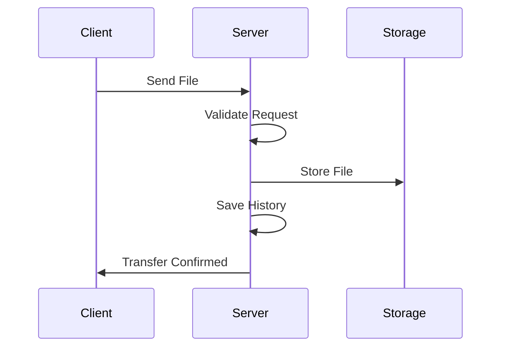
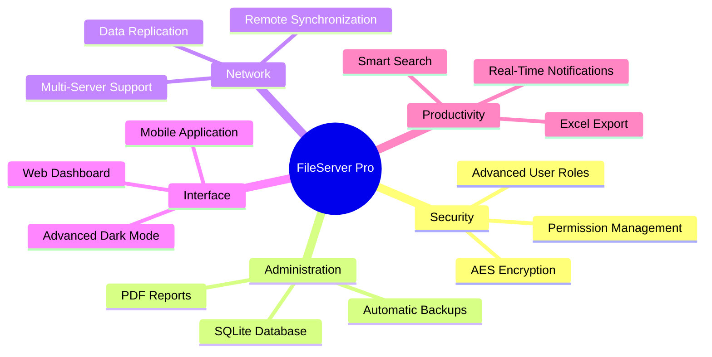

<div align="center">

# 🚀 FileServer Pro

### Professional Document Transfer & Centralized File Management System

### 👨‍💻 Developed by Omar Badrani


<br>


</div>

---

# 📖 Overview

**FileServer Pro** is a professional client-server application built with Python that enables secure file transfer, centralized document storage, real-time monitoring, and complete transfer tracking across a local network.

Designed for businesses, workshops, administrative offices, and organizations that require reliable document management and secure file sharing.

---

# ✨ Key Features

## 🔐 Secure Authentication

- User login system
- Secure password hashing
- Session management
- Access control
- User activity tracking

## 📁 Centralized File Management

- Automatic file reception
- Organized storage structure
- Department-based classification
- Quick folder navigation

## 📊 Real-Time Dashboard

- Total files received
- Storage usage statistics
- Connected client count
- Daily transfer activity
- Live server monitoring

## 🖥️ Network Monitoring

- Connected clients overview
- IP address tracking
- Workstation identification
- Connection history
- Real-time status updates

## 📋 Transfer History

- Detailed transfer logs
- User tracking
- Source IP logging
- File size monitoring
- Destination folder records

## 📝 System Logging

- Real-time logs
- Permanent archive
- Event monitoring
- Exportable records

---

# 🏗️ System Architecture



---

# 🔄 File Transfer Workflow



---

# 📂 Project Structure

```text
FileServer-Pro/
│
├── server_app.py
├── client_app.py
├── requirements.txt
│
├── assets/
│   ├── icons/
│   └── images/
│
├── data/
│   ├── Production/
│   ├── Administration/
│   ├── HumanResources/
│   ├── Sales/
│   ├── Accounting/
│   ├── IT/
│   └── Logistics/
│
└── .logs/
    ├── connections.json
    ├── transfers.json
    └── archives/
```

---

# 📂 Storage Structure

```text
ServerData/
│
├── Production/
├── Administration/
├── HumanResources/
├── Sales/
├── Accounting/
├── IT/
├── Logistics/
│
└── .logs/
```

---

# 📊 Dashboard Overview

The dashboard provides real-time information about:

| Feature | Description |
|----------|-------------|
| 📄 Files Received | Total received documents |
| 💾 Storage Usage | Total transferred data |
| 🖥️ Connected Clients | Active workstations |
| 📅 Daily Activity | Today's transfers |
| 📋 Recent History | Latest operations |

---

# 🔒 Security

FileServer Pro includes several security mechanisms:

- Secure authentication
- Password hashing
- User session management
- Activity logging
- Transfer history tracking
- Connection monitoring
- Access control

---

# ⚙️ Technologies Used

| Technology | Purpose |
|------------|---------|
| Python | Core application |
| CustomTkinter | Modern GUI |
| Socket TCP/IP | Network communication |
| JSON | Data persistence |
| Threading | Multi-client handling |
| Hashlib | Security |
| Pillow | Image processing |

---

# 🚀 Installation

## Clone Repository

```bash
git clone https://github.com/omarbadrani/FileServer-Pro.git

cd FileServer-Pro
```

---

## Create Virtual Environment

### Windows

```bash
python -m venv venv

venv\Scripts\activate
```

### Linux

```bash
python3 -m venv venv

source venv/bin/activate
```

---

## Install Dependencies

```bash
pip install -r requirements.txt
```

---

## Run Server

```bash
python server_app.py
```

---

# 📦 Requirements

```txt
customtkinter>=5.2.0
Pillow>=10.0.0
```

---

# 📸 Screenshots

## 🔐 Login Screen

Replace with actual screenshot:

```text
Secure Authentication Interface
```

## 📊 Dashboard

Replace with actual screenshot:

```text
Real-Time Monitoring Dashboard
```

## 📁 File Explorer

Replace with actual screenshot:

```text
Centralized Document Management
```

---

# 🎯 Future Enhancements



---

# 🤝 Contributing

Contributions are welcome.

```text
Fork Repository
       ↓
Create Branch
       ↓
Develop Feature
       ↓
Commit Changes
       ↓
Open Pull Request
```

---

# 📜 License

MIT License

Copyright (c) 2026 Omar Badrani

Permission is hereby granted, free of charge, to any person obtaining a copy of this software and associated documentation files to use, modify, merge, publish, distribute, sublicense, and/or sell copies of the Software.

---

# ⭐ Support

If you find this project useful:

⭐ Star the repository

🐛 Report issues

💡 Suggest improvements

🤝 Contribute to development

---

<div align="center">

# 🚀 FileServer Pro

### Centralize • Secure • Monitor

### 👨‍💻 Omar Badrani

Built with Python & CustomTkinter

© 2026 Omar Badrani. All Rights Reserved.

</div>
