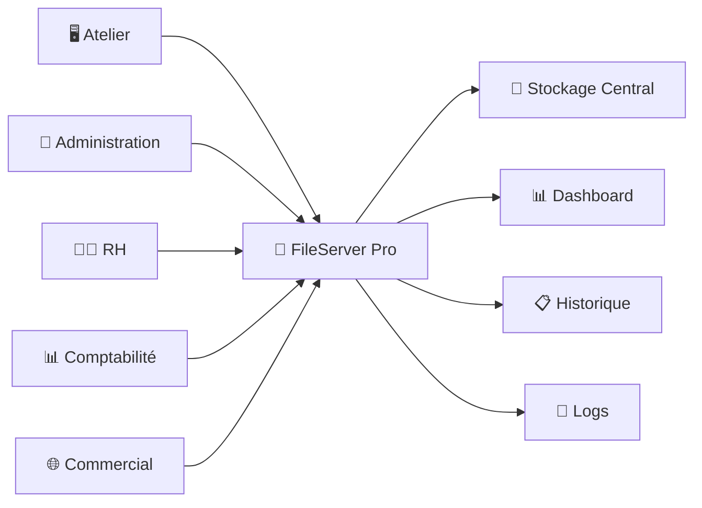
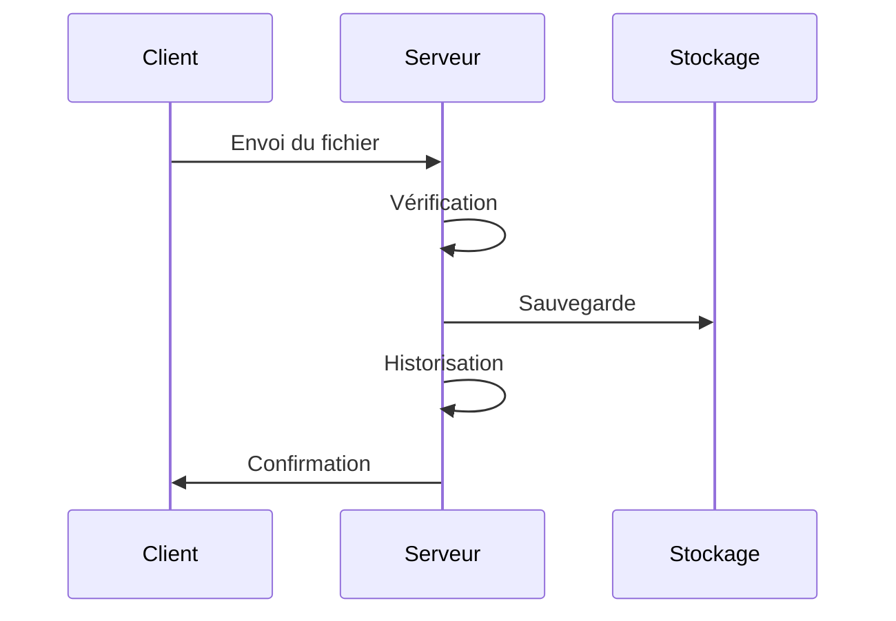
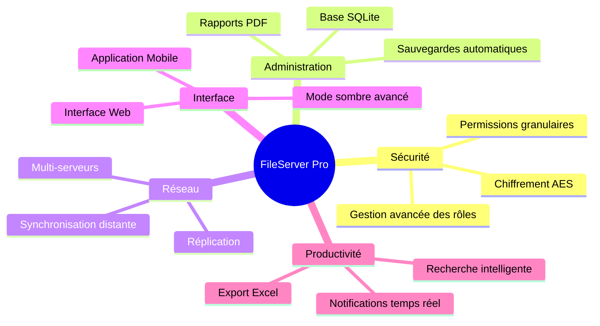

<div align="center">

# 🚀 FileServer Pro

### Solution Professionnelle de Centralisation et de Transfert Documentaire

### 👨‍💻 Développé par Omar Badrani


<br>


</div>

---

# 📖 Présentation

**FileServer Pro** est une application client-serveur développée en Python permettant la réception, la centralisation, l'organisation et la supervision des transferts de fichiers sur un réseau local.

L'application a été conçue pour les entreprises, ateliers, services administratifs et environnements nécessitant un système fiable de gestion documentaire.

---

# ✨ Fonctionnalités

## 🔐 Authentification Sécurisée

- Connexion utilisateur sécurisée
- Gestion des sessions
- Protection contre les accès non autorisés
- Hachage des mots de passe

## 📁 Gestion Documentaire

- Réception automatique des fichiers
- Organisation par département
- Structure de stockage centralisée
- Navigation rapide dans les dossiers

## 📊 Tableau de Bord

- Nombre total de fichiers reçus
- Volume de données transférées
- Nombre de postes connectés
- Activité récente en temps réel

## 🖥️ Supervision Réseau

- Liste des clients connectés
- Adresse IP et nom des postes
- État des connexions
- Historique des connexions

## 📋 Historique des Transferts

- Date et heure
- Utilisateur
- Poste source
- Taille du fichier
- Dossier de destination

## 📝 Journalisation

- Logs temps réel
- Archivage automatique
- Traçabilité complète des opérations

---

# 🏗️ Architecture Générale



---

# 🔄 Cycle de Traitement



---

# 📂 Structure du Projet

```text
FileServer-Pro/
│
├── server_app.py
├── client_app.py
├── requirements.txt
│
├── assets/
│   ├── icons/
│   └── images/
│
├── data/
│   ├── Production/
│   ├── Administration/
│   ├── RH/
│   ├── Commercial/
│   ├── Comptabilite/
│   ├── Informatique/
│   └── Logistique/
│
└── .logs/
    ├── connections.json
    ├── transfers.json
    └── archives/
```

---

# 📂 Organisation des Documents

```text
ServeurData/
│
├── Production/
├── Administration/
├── Commercial/
├── RH/
├── Comptabilite/
├── Informatique/
├── Logistique/
│
└── .logs/
```

---

# 📊 Tableau de Bord

Le dashboard permet de visualiser :

| Information | Description |
|------------|------------|
| 📄 Fichiers reçus | Nombre total de fichiers |
| 💾 Volume transféré | Quantité de données reçues |
| 🖥️ Clients connectés | Nombre de postes actifs |
| 📅 Activité du jour | Transferts quotidiens |
| 📋 Historique récent | Dernières opérations |

---

# 🔒 Sécurité

- Authentification sécurisée
- Hachage des mots de passe
- Journalisation complète
- Historique permanent
- Gestion des utilisateurs
- Contrôle des connexions
- Traçabilité des opérations

---

# ⚙️ Technologies Utilisées

| Technologie | Description |
|------------|------------|
| Python | Langage principal |
| CustomTkinter | Interface graphique moderne |
| Socket TCP/IP | Communication réseau |
| JSON | Stockage des données |
| Threading | Gestion multi-clients |
| Hashlib | Sécurité |
| Pillow | Gestion des images |

---

# 🚀 Installation

## Clonage

```bash
git clone https://github.com/omarbadrani/FileServer-Pro.git

cd FileServer-Pro
```

## Création d'un environnement virtuel

### Windows

```bash
python -m venv venv

venv\Scripts\activate
```

### Linux

```bash
python3 -m venv venv

source venv/bin/activate
```

## Installation des dépendances

```bash
pip install -r requirements.txt
```

## Lancement du serveur

```bash
python server_app.py
```

---

# 📦 Dépendances

```txt
customtkinter>=5.2.0
Pillow>=10.0.0
```

---

# 📸 Captures d'Écran

Ajoutez ici vos captures réelles :

### 🔐 Authentification

```text
Login sécurisé
```

### 📊 Dashboard

```text
Vue d'ensemble du serveur
```

### 📁 Gestion documentaire

```text
Explorateur des fichiers reçus
```

---

# 🎯 Évolutions Futures



---

# 🤝 Contribution

Les contributions sont les bienvenues.

```text
Fork
 ↓
Nouvelle branche
 ↓
Développement
 ↓
Commit
 ↓
Pull Request
```

---

# 📜 Licence

MIT License

Copyright (c) 2026 Omar Badrani

Permission est accordée à toute personne obtenant une copie de ce logiciel et de sa documentation associée d'utiliser, copier, modifier et distribuer le logiciel sous les conditions de la licence MIT.

---

# ⭐ Support du Projet

Si ce projet vous est utile :

⭐ Mettre une étoile sur GitHub

🐛 Signaler les bugs

💡 Proposer des améliorations

🤝 Participer au développement

---

<div align="center">

# 🚀 FileServer Pro

### Centraliser • Sécuriser • Superviser

### 👨‍💻 Omar Badrani

Développé avec Python & CustomTkinter

© 2026 Omar Badrani - Tous droits réservés

</div>
